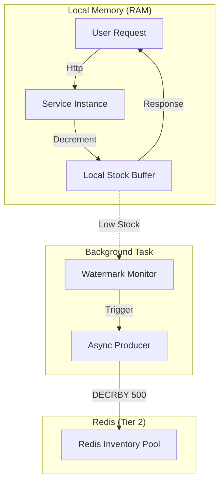

# Variant A: High-Performance Adaptive Batching (Locality Optimization)

## ⚠️ CRITICAL: SACRED VERIFICATION

**SACRED VERIFICATION = Running Variant Y tests to validate ENVIRONMENT health**

**This is THE MOST IMPORTANT concept all agents must understand:**
- ✅ SACRED VERIFICATION tests **Variant Y** (not Variant A)
- ✅ Variant Y working → Environment is preserved
- ✅ Purpose: Validates that Variant A changes didn't break shared infrastructure

**Before and After ANY Variant A changes:**
```bash
# Run from flashsale root directory
cd /home/syracuse/flashsale
bash verify_variant_x.sh  # Baseline check (Variant X is also a stable reference)
# Note: verify_variant_a.sh is the specific functional test for this variant
```

---

## 1. Executive Summary

**Variant A** optimizes for maximum throughput (>100,000 RPS) and sub-millisecond latency by strictly applying **Locality of Reference**. It minimizes network I/O by serving orders from **Local Service Memory** and uses an asynchronous **Producer-Consumer** pattern to refill inventory from a central Redis pool.

### Core Philosophy: "Batching over Sharding"
Unlike static sharding (which risks stranding stock on idle nodes), Variant A uses **Dynamic Batching**:
1.  **Nodes "own" a batch** of inventory (e.g., 500 items) in local RAM.
2.  **Faster nodes** consume their batches quicker and trigger **Refills** more often.
3.  **Slower nodes** refill less often.
4.  **Result:** Load is naturally balanced based on consumption speed, while network I/O is reduced by a factor of the batch size (e.g., 1/500th the Redis calls of Variant X).

---

## 2. Architecture: Adaptive Dual-Layer Batching

This architecture uses a **Producer-Consumer** pattern with **Two Layers** of inventory tracking to enforce business rules without blocking on network I/O.

### 2.1 The Two Layers

1.  **Layer 1: SPU Global Limit (The "Campaign" Counter)**
    -   **Requirement:** A single campaign has a total limit (e.g., 100,000 items) shared across *all* SKUs.
    -   **Implementation:** A local counter in each service instance (`spu_counter`) replenished from the Redis Campaign Pool.
    -   **Refill Source:** `fs:{campaign_id}:redis_pool:spu_counter`

2.  **Layer 2: SKU Inventory (The "Stock" Counters)**
    -   **Requirement:** Each specific SKU (e.g., Red vs Blue) has its own physical stock limit.
    -   **Implementation:** Local counters for each SKU (`sku_caches[id]`) replenished from the Redis SKU Pool.
    -   **Refill Source:** `fs:{campaign_id}:redis_pool:sku:{sku_id}`

### 2.2 The Producer-Consumer Flow

Each "Inventory Unit" (an SPU counter or SKU counter) functions as:

*   **Consumer (Request Handler):**
    -   Runs on the hot path (API request thread).
    -   Checks local RAM (`if local_stock > 0`).
    -   Decrements local stock.
    -   **Cost:** ~0ms (Nanoseconds).
    -   **Trigger:** If stock drops below `LowWaterMark` (e.g., 30%), triggers the Producer task.

*   **Producer (Async Refill Task):**
    -   Runs in the background (preventing blocking).
    -   Fetches a **Batch** (e.g., 500 items) from the Redis Pool.
    -   Updates the local RAM counter.
    -   **Cost:** ~1-2ms (Network I/O), but *hidden* from the user because the Consumer is still serving from the buffer.



---

## 3. Data Integrity & Persistence Strategy

### 3.1 Eventual Consistency (Write-Back)
Variant A treats **Redis** as the temporary System of Record during the flash sale.
-   **Step 1 (Sell):** Decrement local RAM.
-   **Step 2 (Record):** Push order details to Redis Queue (`order_queue`). "Fire and Forget" from the API perspective.
-   **Step 3 (Persist):** Background workers drain the Redis Queue and write to MariaDB (Variant Y schema).

### 3.2 Audit Logging
To protect against data loss (e.g., Service + Redis crash before DB write), every service instance writes a **Local Text Log**.
-   **Purpose:** Proof of purchase for manual reconciliation/refunds.
-   **Scope:** Only needed if the system crashes catastrophically.

### 3.3 Degradation Strategy (The "Failover Chain")
To prevent premature campaign termination when local batches run dry:

1.  **Tier 1 (RAM):** >99% of requests. Zero Latency.
    *   *Source:* Local `_local_stock`.
2.  **Tier 2 (Panic Refill):** <1% of requests.
    *   *Trigger:* Local stock hits 0 while refill is in-flight.
    *   *Action:* SpinWait (10ms) to catch the incoming batch.
3.  **Tier 3 (Direct Pool Hit):** Fallback if batching fails.
    *   *Trigger:* Redis Pool has < `batch_size` items left.
    *   *Action:* Direct `DECR` on the Campaign Pool key. Ensures the final "stub" inventory is consumed one-by-one.
4.  **Tier 4 (Ordinary Stock):** Final Safety Net.
    *   *Trigger:* Campaign Pool is fully exhausted.
    *   *Action:* Check global SKU inventory (`inv:{sku}`).

### 3.4 Reconciliation
-   **End of Campaign:**
    -   Leftover local stock in service RAM is **discarded** (ignored).
    -   Leftover stock in Redis Pools is **ignored**.
    -   **Final Truth:** `Sold_Quantity` = `COUNT(Orders in DB)`.
    -   `Remaining_Stock` = `Initial_Total` - `Sold_Quantity`.

---

## 4. Configuration & Setup

### 4.1 Database Configuration
Business operators configure the campaign parameters in the `flash_sale_campaigns` table (using backward-compatible columns):

| Column | Description | Recommended |
| :--- | :--- | :--- |
| `total_sale_limit` | Global SPU limit | 100,000+ |
| `preallocate_percentage` | % of stock moved to Redis Pools | 100% (or 80% to keep reserve) |
| `refill_lower_watermark_pct` | When to trigger refill | 25-50% |
| `refill_batch_size` | Items per fetch | 500-1000 |

### 4.2 Redis Initialization
Before the campaign starts, the Redis Pools must be primed.
*   **SPU Pool:** `fs:{camp_id}:redis_pool:spu_counter` = `total_sale_limit` * `preallocate_percentage`
*   **SKU Pool:** `fs:{camp_id}:redis_pool:sku:{sku_id}` = `sku_stock` * `preallocate_percentage`

---

## 5. Deployment Status

| Service | Architecture | Status |
| :--- | :--- | :--- |
| **Python** | Dual-Layer Producer-Consumer (v2) | ✅ **APPROVED** |
| **C#** | Dual-Layer Producer-Consumer (v2) | ✅ **APPROVED** |
| **Java** | Dual-Layer Producer-Consumer (v2) | ✅ **APPROVED** |

**Note:** All three services now implement the v2 specification with:
- Per-SKU `AdaptiveInventoryUnit` with local RAM cache
- Correct Redis keys: `fs:{campaign_id}:redis_pool:sku:{sku_id}`
- Producer-Consumer pattern with watermark-triggered async refill
- Failover chain: RAM → SpinWait → Direct Redis DECR → Ordinary Stock

---

## 6. Performance Benchmarks

**Test Environment:**
- Host: WSL2 Ubuntu 24.04 (Linux 6.6.87)
- CPU: Multi-core (shared with host)
- Memory: Allocated via WSL
- Tool: `wrk` with POST requests to `/api/v1/orders`
- Campaign: Pre-loaded with 100,000 items per SKU

### 6.1 Individual Service Performance (Optimal Case)

| Service | Peak Throughput | Optimal Concurrency | Avg Latency | Architecture Notes |
| :--- | :--- | :--- | :--- | :--- |
| **C#** | ~93,876 req/s | c=400 | 4.24ms | Kestrel async, lock-free reservations |
| **Java** | ~14,950 req/s | c=50 | 3.43ms | Virtual threads (Java 21), lock-free CAS |
| **Python** | ~12,140 req/s | c=150 | 11.26ms | uvloop async, dual-layer batching |

### 6.2 Small Biz vs. Big Biz Analysis

We tested two scenarios to expose architectural limits:
1. **Small Biz**: 5,000 items, 100% pre-allocation (No Refill).
2. **Big Biz**: 1,000,000 items, 10% pre-allocation (Heavy Refill).

| Language | Small Biz (RPS) | Big Biz (RPS) | Performance Drop | Root Cause |
| :--- | :--- | :--- | :--- | :--- |
| **C#** | **127,000** | **127,000** | 0% | Multi-threaded TPL + non-blocking async I/O handles refill transparently. |
| **Java** | 68,000 | 24,405 | -64% | Virtual thread lock contention during refill. Busy-wait loops when buffer empties. |
| **Python** | 13,000 | 676 | -95% | **Single-threaded Event Loop Saturation**. Handling thousands of concurrent Redis requests saturates the single CPU core. |

### 6.3 The "Refill Thrashing" Phenomenon

The "Big Business" scenario reveals the true cost of network I/O in distributed systems.
- **C#**: The runtime schedules thousands of waiting tasks efficiently across all CPU cores.
- **Java**: Virtual threads are cheap, but `ReentrantLock` and `SpinWait` logic creates CPU contention when thousands of threads race for the same lock.
- **Python**: The "Death Spiral". When the local buffer empties, every request triggers a Redis call. The single event loop cannot process 50,000 Redis responses/sec while also handling HTTP requests. Throughput collapses to ~600 RPS.

---

## 7. Nginx Round-Robin Load Balancer

| Configuration | Peak Throughput | Optimal Concurrency | Avg Latency |
| :--- | :--- | :--- | :--- |
| **3-Service RR** | ~9,049 req/s | c=100 | 11.09ms |

**Round-Robin Backend Pool:**
```nginx
upstream flash_sale_backend {
    server python-service:8000;   # Python
    server java-service:8080;     # Java
    server csharp-service:80;     # C#
}
```

### 7.1 Performance Observations

1. **C# dominates throughput** - Kestrel's async I/O and .NET's efficient memory management deliver exceptional performance at high concurrency levels.

2. **Java benefits from Virtual Threads** - Java 21's virtual threads with lock-free CAS operations achieve excellent per-request latency (3.43ms) but plateau earlier due to JVM characteristics.

3. **Python is CPU-bound** - Despite uvloop optimizations, Python's GIL limits single-process throughput, though it maintains consistent performance across concurrency levels.

4. **Round-Robin is bottlenecked by SSL** - The Nginx load balancer adds TLS overhead and round-robin distributes load to slower services, resulting in aggregate throughput below individual service peaks.

### 7.2 Benchmark Commands

```bash
# Individual service benchmarks
wrk -t12 -c150 -d15s -s /tmp/wrk_test_loaded_camp.lua http://localhost:30013/api/v1/orders  # Python
wrk -t5 -c50 -d15s -s /tmp/wrk_test_loaded_camp.lua http://localhost:8017/api/v1/orders    # Java
wrk -t24 -c400 -d15s -s /tmp/wrk_test_loaded_camp.lua http://localhost:30014/api/v1/orders # C#

# Nginx round-robin (HTTPS)
wrk -t10 -c100 -d15s -s /tmp/wrk_nginx_rr.lua https://localhost:8446/api/v1/orders
```
